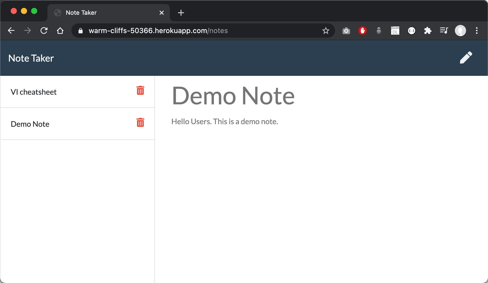
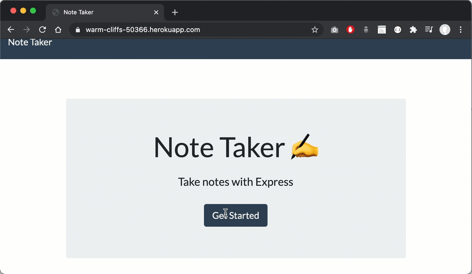

## Description 
   
This is a note taking application build using Node and  ExpressJS and deployed on Heroku.


 

  ## Table of Contents
  * [Installation](#installation)
  * [Usage](#usage)
  * [Contributing](#contributing)
  * [Tests](#tests)
  * [License](#license)
  
  ## Installation
    
Clone the repository to your local development environment.

```
git clone https://github.com/binayaluitel2/note-taker.git
```

Navigate to the note-taker folder using the command prompt.

Run `npm install` to install all dependencies. To use the application locally, run `node server.js` in your CLI, and then open `http://localhost:3000` in your preferred browswer. 

[live on Heroku](https://warm-cliffs-50366.herokuapp.com/) for you to use as well.  
  ## Usage 
    
  
  
  ## Contributing
  
  Binaya Luitel
  
  ## Tests  
  
 None
  
  ## License
  
  MIT License
  
